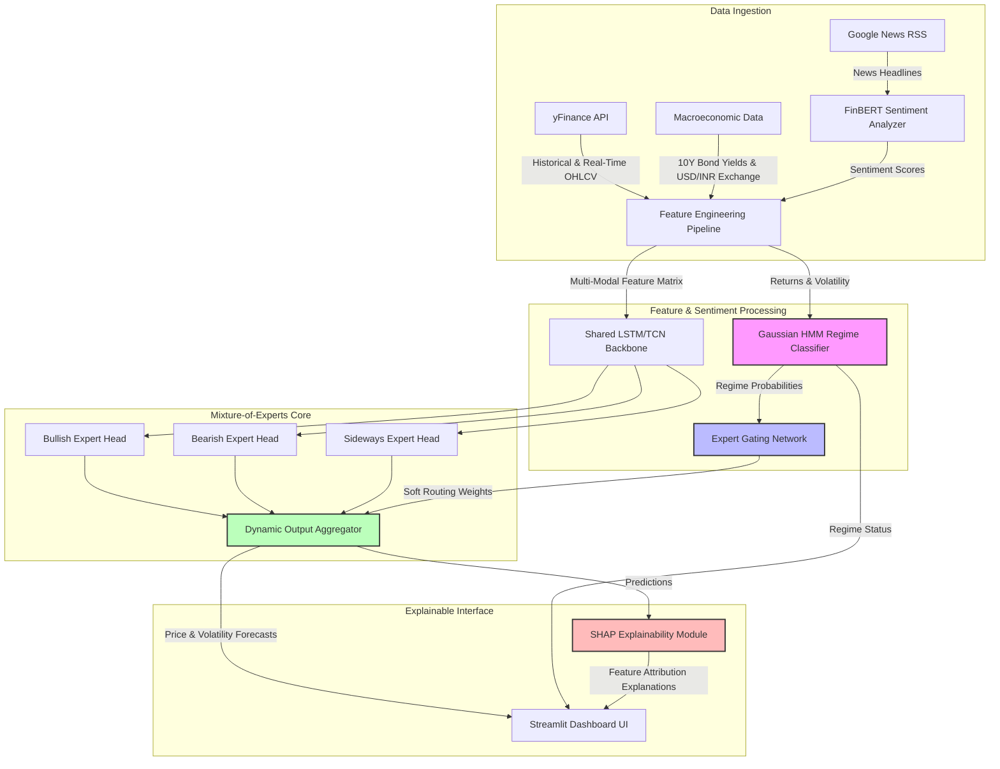

# AuraTrade AI: Regime-Conditioned Mixture-of-Experts (MoE) Stock Forecaster for Swing Trading

A multi-modal financial forecasting engine designed to predict stock prices across multiple horizons (1-day, 3-day, and 7-day) by conditioning predictions on dynamically detected market regimes (Bullish, Bearish, and Sideways). 

---

## 👥 Project Team & Affiliation
* **Institute:** Vishwakarma Institute of Technology (VIT), Pune
* **Guide:** Prof. Jyoti Kanjalkar
* **Group Number:** 2
* **Team Members:**
  * **Vedant Patil** ([vedant.patil24@vit.edu](mailto:vedant.patil24@vit.edu))
  * **Tanishka Phad** ([tanishka.phad24@vit.edu](mailto:tanishka.phad24@vit.edu))
  * **Sanika Piraji** ([sanika.piraji241@vit.edu](mailto:sanika.piraji241@vit.edu))

---

## 📌 Project Focus: Swing Trading & Regime Awareness
Traditional deep learning stock prediction models assume the financial market is a stationary process, training a single model (LSTM, GRU, or Transformer) on the entire historical dataset. However, a model's optimal weights for trending bull markets and choppy sideways chop are fundamentally different. 

**AuraTrade** addresses this limitation by tailoring predictions specifically for **swing traders** (who hold positions for 3 to 10 days) using a **Regime-Conditioned Mixture-of-Experts (MoE)** architecture.

---

## 💡 Core Architecture & Methodology (The Differentiators)

### 1. Unsupervised Gaussian HMM Regime Classifier
* Markets are classified into three regimes: **Bullish (State 0)**, **Bearish (State 1)**, and **Sideways (State 2)**.
* We leverage a **Gaussian Hidden Markov Model (HMM)** trained on daily asset returns and rolling historical volatility.
* This classifier outputs a probability distribution over the current regime, which is used as the routing key.

### 2. Regime-Conditioned Mixture-of-Experts (MoE)
Instead of a single forecasting neural network, we build a custom PyTorch MoE model:
* **Shared Backbone:** A sequential layer (LSTM or Temporal Convolutional Network) extracts generalized temporal features from the price history and technical indicators.
* **Expert Heads:** Three distinct neural networks (Experts) specialize in forecasting under specific market conditions (Bullish Expert, Bearish Expert, Sideways Expert).
* **Gating Network:** A soft gating mechanism routes the shared backbone features to the experts, weighting their respective output predictions dynamically based on the HMM regime probabilities.

### 3. Regime-Aware Sentiment Weighting
* Daily news headlines from Google News RSS are analyzed using a fine-tuned financial transformer (**FinBERT**) to output daily sentiment scores.
* Rather than simple static inclusion, sentiment weights are adjusted by the detected regime (e.g., news sentiment is weighted more heavily during sideways markets where trend momentum is low, and down-weighted during strong trending regimes).

### 4. Swing-Trader Explainability Layer
To align with the **IEEE 7000 (Transparency/Explainability)** standards, the final Streamlit dashboard translates complex mathematical outputs into plain-English recommendations:
* **Gating Probabilities:** Displays the current active regime distribution (e.g., *72% Bullish, 20% Sideways, 8% Bearish*).
* **Feature Attributions (SHAP):** Calculates which factors (sentiment, volume, SMA-20) most heavily influenced the forecast.
* **Auto-Generated Natural-Language Recommendation:** Merges the forecast, confidence interval, active regime, and SHAP attributions into a human-readable summary (e.g., *"Model suggests a 1-day target of ₹X (+1.8%) with high confidence. Driven by strong positive news sentiment and rising volume under a detected Bullish Regime."*)

---

## 📐 System Architecture



---

## 📈 Selected Stock Universe
We evaluate our model across 8 deliberately chosen NIFTY 50 stocks representing diverse sectors, volatility profiles, and macroeconomic dependencies:

| # | Ticker | Sector | Volatility Profile | Rationale |
| :--- | :--- | :--- | :--- | :--- |
| 1 | `ICICIBANK.NS` | Banking | Low-to-Medium | Large-cap stability anchor; benchmark for standard regimes. |
| 2 | `HCLTECH.NS` | IT | Medium | Highly sensitive to global earnings cycles and news sentiment. |
| 3 | `INDIGO.NS` | Aviation | High | Regime-sensitive; directly impacted by oil price and capacity cycles. |
| 4 | `MARUTI.NS` | Auto | High | Consumer-discretionary momentum stock with cyclical swings. |
| 5 | `TRENT.NS` | Retail | High | High-momentum consumer name; news and sentiment-driven. |
| 6 | `HINDALCO.NS` | Metals | High | Commodity-price dependent; classic structural cycle swings. |
| 7 | `ONGC.NS` | Oil & Gas | High | Heavily correlated with global crude oil macro regimes. |
| 8 | `ADANIENT.NS` | Conglomerate | Extreme | Historical susceptibility to sharp, sudden trend reversals. |

---

## 🧪 Experimental Benchmarking & Comparisons
To scientifically prove the model's validity for the final research paper, we compare **4 predictive models** across **3 evaluation layers**:

### The 4 Models:
1. **Linear Regression Baseline:** The basic statistical control to prove deep learning added-value.
2. **Plain LSTM:** Standard sequential baseline trained without sentiment or regime inputs.
3. **LSTM + Sentiment:** Isolates the exact improvement added by the FinBERT sentiment feature alone.
4. **Regime-Conditioned MoE (AuraTrade):** The proposed architecture (Backbone + HMM Gated Experts).

### The 3 Evaluation Layers:
* **Layer 1: Overall Accuracy:** General performance across the entire test set (RMSE, MAE, MAPE) for 1-day, 3-day, and 7-day horizons.
* **Layer 2: Per-Regime Accuracy:** Accuracy calculated independently inside Bullish, Bearish, and Sideways intervals to check expert performance.
* **Layer 3: Transition-Period Accuracy (Headline Metric):** Metrics calculated exclusively within a **$\pm$5-day window around regime transition points**. This evaluates whether our model manages regime flips (where traders lose the most money) better than vanilla LSTMs.

---

## 📅 Execution Roadmap

```
Week 1 (Completed)
├── Conduct literature survey of 9 core papers.
├── Identify research gaps (un-modeled regimes, black-box trading).
└── Select 8 target stocks and formalize MoE-regime methodology.

Week 2 (Active)
├── Fetch historical OHLCV data via yFinance & News headlines.
├── Train Gaussian HMM on returns/volatility to label regimes.
├── Build FinBERT sentiment parser.
└── Train baseline Linear Regression & Plain LSTM models.

Week 3 (Upcoming)
├── Build custom PyTorch MoE model (Backbone + 3 Experts + Soft Gate).
├── Train and validate MoE model using TimeSeriesSplit.
├── Perform overall, per-regime, and transition-period evaluations.
└── Start draft of IEEE-style research paper.

Week 4 (Upcoming)
├── Package explanations (SHAP attributions + template text summary).
├── Develop Streamlit Dashboard (chart overlays, regime badges).
└── Finalize paper draft, slides, and project presentation.
```

---

## 🚀 Installation & Setup (For Week 2)

```bash
# Clone the repository
git clone https://github.com/vedant-0789/stockprediction.git
cd stockprediction

# Install requirements
pip install -r requirements.txt

# Launch Dashboard
streamlit run app.py
```
